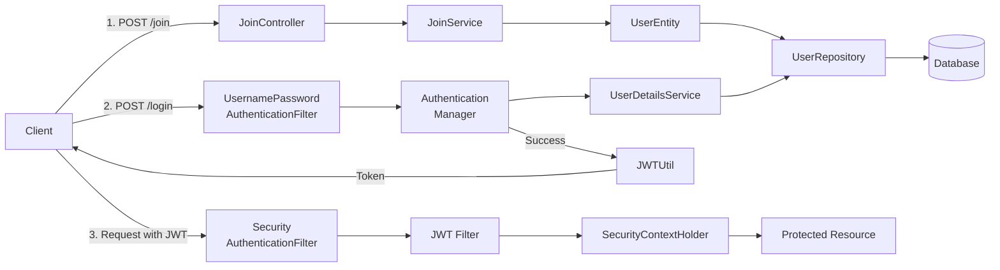

# Spring Security와 JWT 인증/인가 구현 가이드

## 프로젝트 개요
- **목표**: Spring Security 6.x 버전을 사용한 JWT 기반 인증/인가 시스템 구현
- **환경설정**:
    - Spring Boot 3.2.1
    - Spring Security 6.2.1
    - MySQL (데이터베이스)
    - Spring Data JPA (ORM)
    - Gradle (빌드 도구)

## 시스템 구성 요소 설명

### 1. 회원가입 프로세스
- **경로**: POST /join
- **흐름**: JoinController → JoinService → UserEntity → UserRepository → Database
- **특징**: 세션 방식과 JWT 방식 모두 동일한 회원가입 로직 사용

### 2. 로그인 프로세스
- **경로**: POST /login
- **주요 컴포넌트**:
    1. UsernamePasswordAuthenticationFilter: 사용자 인증 요청 처리
    2. AuthenticationManager: 실제 인증 프로세스 관리
    3. UserDetailsService: DB에서 사용자 정보 조회
    4. JWTUtil: 인증 성공 시 JWT 토큰 생성

### 3. 인가 프로세스
- **특징**: Stateless 방식으로 구현
- **컴포넌트**:
    1. SecurityAuthenticationFilter: 초기 보안 검증
    2. JWT Filter: 토큰 유효성 검증
    3. SecurityContextHolder: 임시 세션 관리

## 구현 시 주의사항

1. **버전 호환성**
    - Spring Security의 메서드가 버전별로 상당히 다름
    - 최신 버전(6.x)에서는 많은 메서드가 Deprecated됨

2. **토큰 관리**
    - 본 구현에서는 단일 토큰 방식 사용
    - 실무에서는 Access Token + Refresh Token 구조 권장

3. **보안 고려사항**
    - 모든 요청에 대해 JWT 검증 필요
    - 토큰 만료 시간 적절히 설정
    - 요청마다 새로운 SecurityContext 생성

## 향후 확장 가능성
1. OAuth2.0 기반 소셜 로그인 통합
2. Refresh Token 구현
3. 토큰 블랙리스트 관리
4. 권한 기반 접근 제어 강화

이 가이드는 기본적인 JWT 인증/인가 구현을 위한 참고자료로 활용할 수 있으며, 실무 적용 시에는 추가적인 보안 요구사항을 고려해야 합니다.