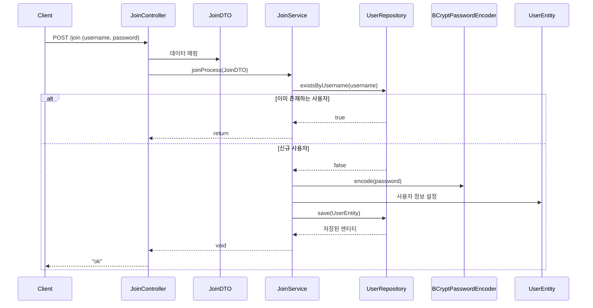

# Spring Security JWT - 회원가입 구현 가이드

## 1. 전체 아키텍처 설계



## 2. DTO(Data Transfer Object) 구현

```java
@Setter
@Getter
public class JoinDTO {
    private String username;
    private String password;
}
```

- 클라이언트로부터 받는 회원가입 데이터를 담는 객체
- username과 password 필드만 포함

## 3. Controller 구현

```java
@Controller
@ResponseBody
public class JoinController {
    private final JoinService joinService;
    
    public JoinController(JoinService joinService) {
        this.joinService = joinService;
    }
    
    @PostMapping("/join")
    public String joinProcess(JoinDTO joinDTO) {
        joinService.joinProcess(joinDTO);
        return "ok";
    }
}
```

- `@ResponseBody`: REST API 응답을 위해 사용
- 생성자 주입 방식으로 JoinService 의존성 주입
- `/join` 엔드포인트로 POST 요청 처리

## 4. Service 구현

```java
@Service
public class JoinService {
    private final UserRepository userRepository;
    private final BCryptPasswordEncoder bCryptPasswordEncoder;
    
    // 생성자
    public JoinService(UserRepository userRepository, BCryptPasswordEncoder bCryptPasswordEncoder) {
        this.userRepository = userRepository;
        this.bCryptPasswordEncoder = bCryptPasswordEncoder;
    }
    
    public void joinProcess(JoinDTO joinDTO) {
        // 1. 중복 사용자 검증
        if (userRepository.existsByUsername(joinDTO.getUsername())) {
            return;
        }
        
        // 2. 새로운 사용자 엔티티 생성
        UserEntity user = new UserEntity();
        user.setUsername(joinDTO.getUsername());
        user.setPassword(bCryptPasswordEncoder.encode(joinDTO.getPassword()));
        user.setRole("ROLE_ADMIN");
        
        // 3. 데이터베이스에 저장
        userRepository.save(user);
    }
}
```

- 비즈니스 로직 처리
- 패스워드 암호화
- 중복 사용자 검증
- 사용자 권한 설정

## 5. Repository 구현

```java
public interface UserRepository extends JpaRepository<UserEntity, Integer> {
    Boolean existsByUsername(String username);
}
```

- JpaRepository 상속으로 기본 CRUD 기능 제공
- `existsByUsername`: 사용자명 중복 검사를 위한 커스텀 메서드

## 6. 주요 특징
1. 패스워드 암호화
    - BCryptPasswordEncoder를 사용하여 안전한 패스워드 저장
2. 사용자 검증
    - 중복 가입 방지를 위한 username 검증
3. 권한 설정
    - 기본적으로 "ROLE_ADMIN" 권한 부여

## 7. API 테스트
```http
POST http://localhost:8080/join
Content-Type: application/json

{
    "username": "testuser",
    "password": "password123"
}
```

## 8. 보안 고려사항
1. 패스워드 유효성 검사 추가 필요
2. 사용자 입력 데이터 검증
3. 적절한 예외 처리
4. 응답 상태 코드 및 메시지 구체화