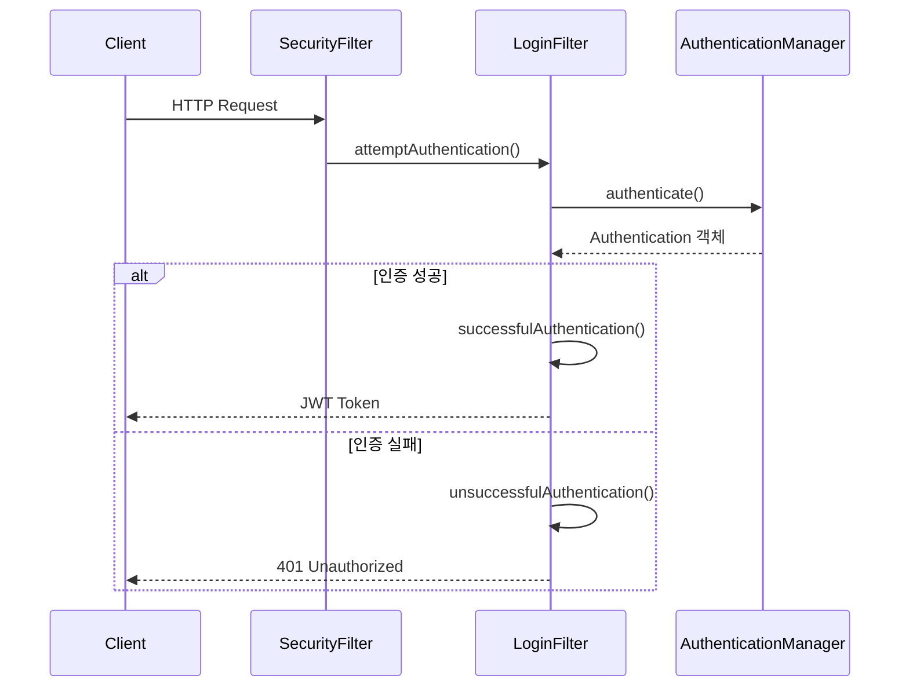

# Spring Security JWT - 로그인 필터 구현 가이드

## 1. Spring Security 필터 구조



## 2. LoginFilter 구현

```java
public class LoginFilter extends UsernamePasswordAuthenticationFilter {
    private final AuthenticationManager authenticationManager;

    public LoginFilter(AuthenticationManager authenticationManager) {
        this.authenticationManager = authenticationManager;
    }

    @Override
    public Authentication attemptAuthentication(HttpServletRequest request,
                                                HttpServletResponse response)
            throws AuthenticationException {
        // 1. 요청에서 인증 정보 추출
        String username = obtainUsername(request);
        String password = obtainPassword(request);

        // 2. 인증 토큰 생성
        UsernamePasswordAuthenticationToken authToken =
                new UsernamePasswordAuthenticationToken(username, password, null);

        // 3. 인증 수행
        return authenticationManager.authenticate(authToken);
    }

    @Override
    protected void successfulAuthentication(...) {
        // JWT 토큰 생성 및 응답 로직 구현 예정
    }

    @Override
    protected void unsuccessfulAuthentication(...) {
        // 인증 실패 처리 로직 구현 예정
    }
}
```

### 주요 메서드 설명

1. `attemptAuthentication`: 인증 시도를 처리
2. `successfulAuthentication`: 인증 성공 시 JWT 토큰 발급
3. `unsuccessfulAuthentication`: 인증 실패 시 처리

## 3. SecurityConfig 설정

```java

@Configuration
@EnableWebSecurity
public class SecurityConfig {
    private final AuthenticationConfiguration authenticationConfiguration;

    // AuthenticationManager 빈 등록
    @Bean
    public AuthenticationManager authenticationManager(
            AuthenticationConfiguration configuration) throws Exception {
        return configuration.getAuthenticationManager();
    }

    @Bean
    public SecurityFilterChain filterChain(HttpSecurity http) throws Exception {
        http
                .csrf((auth) -> auth.disable())
                .formLogin((auth) -> auth.disable())
                .httpBasic((auth) -> auth.disable())
                .authorizeHttpRequests((auth) -> auth
                        .requestMatchers("/login", "/", "/join").permitAll()
                        .anyRequest().authenticated())
                // //필터 추가 LoginFilter()는 인자를 받음 (AuthenticationManager() 메소드에 authenticationConfiguration 객체를 넣어야 함) 따라서 등록 필요
                .addFilterAt(
                        new LoginFilter(authenticationManager(authenticationConfiguration)),
                        UsernamePasswordAuthenticationFilter.class)
                .sessionManagement((session) -> session
                        .sessionCreationPolicy(SessionCreationPolicy.STATELESS));

        return http.build();
    }
}
```

## 4. 인증 처리 흐름

1. 클라이언트가 로그인 요청 전송
2. LoginFilter가 요청을 가로채서 인증 정보 추출
3. AuthenticationManager에게 인증 처리 위임
4. 인증 결과에 따라 성공/실패 처리
    - 성공: JWT 토큰 발급
    - 실패: 401 Unauthorized 응답

## 5. 주의사항

1. Form 로그인 비활성화 필수
2. CSRF 보호 비활성화 (JWT 사용 시)
3. 세션 관리 정책을 STATELESS로 설정
4. 인증 실패 시 적절한 예외 처리 필요

## 다음 단계

1. UserDetailsService 구현
2. JWT 토큰 생성 로직 구현
3. 인증 성공/실패 핸들러 구현