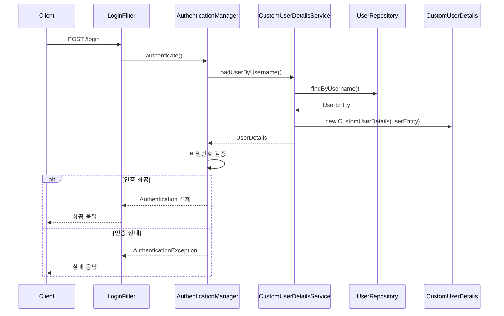

# Spring Security JWT - 데이터베이스 기반 인증 구현 가이드

## 1. 인증 프로세스 아키텍처



## 2. Repository 구현

```java
public interface UserRepository extends JpaRepository<UserEntity, Integer> {
    Boolean existsByUsername(String username);

    UserEntity findByUsername(String username);  // 사용자 조회 메서드
}
```

## 3. CustomUserDetailsService 구현

```java

@Service
public class CustomUserDetailsService implements UserDetailsService {
    private final UserRepository userRepository;

    // 생성자 주입
    public CustomUserDetailsService(UserRepository userRepository) {
        this.userRepository = userRepository;
    }

    @Override
    public UserDetails loadUserByUsername(String username) throws UsernameNotFoundException {
        UserEntity userData = userRepository.findByUsername(username);

        if (userData != null) {
            return new CustomUserDetails(userData);
        }
        throw new UsernameNotFoundException("User not found: " + username);
    }
}
```

## 4. CustomUserDetails 구현

```java
public class CustomUserDetails implements UserDetails {
    private final UserEntity userEntity;

    // 권한 정보 제공
    @Override
    public Collection<? extends GrantedAuthority> getAuthorities() {
        Collection<GrantedAuthority> authorities = new ArrayList<>();
        authorities.add(() -> userEntity.getRole());
        return authorities;
    }

    // 사용자 정보 제공
    @Override
    public String getPassword() {
        return userEntity.getPassword();
    }

    @Override
    public String getUsername() {
        return userEntity.getUsername();
    }

    // 계정 상태 확인
    @Override
    public boolean isAccountNonExpired() {
        return true;
    }

    @Override
    public boolean isAccountNonLocked() {
        return true;
    }

    @Override
    public boolean isCredentialsNonExpired() {
        return true;
    }

    @Override
    public boolean isEnabled() {
        return true;
    }
}
```

## 5. 주요 기능 설명

1. **사용자 조회**
    - UserRepository를 통해 데이터베이스에서 사용자 정보 조회
    - findByUsername 메서드로 사용자명으로 검색

2. **사용자 정보 변환**
    - UserEntity를 Spring Security가 이해할 수 있는 UserDetails 타입으로 변환
    - CustomUserDetails 클래스가 이 변환을 담당

3. **권한 처리**
    - getAuthorities() 메서드를 통해 사용자의 권한 정보 제공
    - 데이터베이스에 저장된 role 정보를 Spring Security 권한으로 변환

4. **계정 상태 검증**
    - 계정 만료, 잠금, 인증 정보 만료, 활성화 상태 등 확인
    - 현재 구현에서는 모든 상태를 true로 반환

## 6. 다음 단계

1. JWT 토큰 생성 유틸리티 구현
2. 로그인 성공 시 JWT 토큰 발급
3. 토큰 검증 필터 구현

## 7. 보안 고려사항

1. 사용자 조회 실패 시 적절한 예외 처리
2. 비밀번호 암호화 검증
3. 권한 기반 접근 제어 구현
4. 계정 상태에 따른 적절한 처리