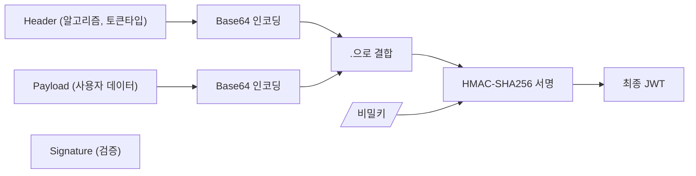

# Spring Security JWT - JWT 유틸리티 구현 가이드

## 1. JWT 구조 및 원리
JWT는 Header, Payload, Signature 세 부분으로 구성됩니다:



- Header
  - JWT임을 명시
  - 사용된 암호화 알고리즘

- Payload
  - 정보

- Signature
  - 암호화알고리즘((BASE64(Header))+(BASE64(Payload)) + 암호화키)


JWT의 특징은 내부 정보를 단순 BASE64 방식으로 인코딩하기 때문에 외부에서 쉽게 디코딩 할 수 있다.

외부에서 열람해도 되는 정보를 담아야하며, 토큰 자체의 발급처를 확인하기 위해서 사용한다.

(지폐와 같이 외부에서 그 금액을 확인하고 금방 외형을 따라서 만들 수 있지만 발급처에 대한 보장 및 검증은 확실하게 해야하는 경우에 사용한다. 따라서 토큰 내부에 비밀번호와 같은 값 입력 금지)
## 2. 시크릿 키 설정
```yaml
spring:
  jwt:
    secret: vmfhaltmskdlstkfkdgodyroqkfwkdbalroqkfwkdbalaaaaaaaaaaaaaaaabbbbb
```

## 3. JWTUtil 클래스 구현

```java
@Component
public class JWTUtil {
    private final SecretKey secretKey;
    
    // 생성자: 시크릿 키 초기화
    public JWTUtil(@Value("${spring.jwt.secret}") String secret) {
        this.secretKey = new SecretKeySpec(
            secret.getBytes(StandardCharsets.UTF_8), 
            Jwts.SIG.HS256.key().build().getAlgorithm()
        );
    }
    
    // 토큰에서 username 추출
    public String getUsername(String token) {
        return Jwts.parser()
                  .verifyWith(secretKey)
                  .build()
                  .parseSignedClaims(token)
                  .getPayload()
                  .get("username", String.class);
    }
    
    // 토큰에서 role 추출
    public String getRole(String token) {
        return Jwts.parser()
                  .verifyWith(secretKey)
                  .build()
                  .parseSignedClaims(token)
                  .getPayload()
                  .get("role", String.class);
    }
    
    // 토큰 만료 여부 확인
    public Boolean isExpired(String token) {
        return Jwts.parser()
                  .verifyWith(secretKey)
                  .build()
                  .parseSignedClaims(token)
                  .getPayload()
                  .getExpiration()
                  .before(new Date());
    }
    
    // JWT 토큰 생성
    public String createJwt(String username, String role, Long expiredMs) {
        return Jwts.builder()
                  .claim("username", username)
                  .claim("role", role)
                  .issuedAt(new Date(System.currentTimeMillis()))
                  .expiration(new Date(System.currentTimeMillis() + expiredMs))
                  .signWith(secretKey)
                  .compact();
    }
}
```

## 4. 주요 기능 설명

### 1. 시크릿 키 초기화
- application.yml에서 시크릿 키 로드
- HS256 알고리즘용 SecretKey 객체 생성

### 2. 토큰 검증 메서드
1. `getUsername()`: 토큰에서 사용자명 추출
2. `getRole()`: 토큰에서 권한 정보 추출
3. `isExpired()`: 토큰 만료 여부 확인

### 3. 토큰 생성 메서드
- `createJwt()`: 새로운 JWT 토큰 생성
    - username과 role을 claim으로 추가
    - 발급 시간(issuedAt) 설정
    - 만료 시간(expiration) 설정
    - 시크릿 키로 서명

## 5. 보안 고려사항

1. **시크릿 키 관리**
    - 충분히 긴 키 사용 (최소 256비트)
    - 환경변수나 외부 설정으로 관리
    - 실제 운영 환경에서는 암호화하여 저장

2. **토큰 페이로드**
    - 민감한 정보(비밀번호 등) 포함 금지
    - 필요한 최소한의 정보만 포함

3. **만료 시간**
    - 적절한 만료 시간 설정
    - 보안과 사용자 경험 사이의 균형 고려

4. **알고리즘 선택**
    - HS256 (HMAC-SHA256) 사용
    - 대칭키 암호화 방식 채택

## 6. 다음 단계
1. JWT 필터 구현
2. 인증 성공 핸들러에서 JWT 발급
3. 토큰 기반 인증 구현