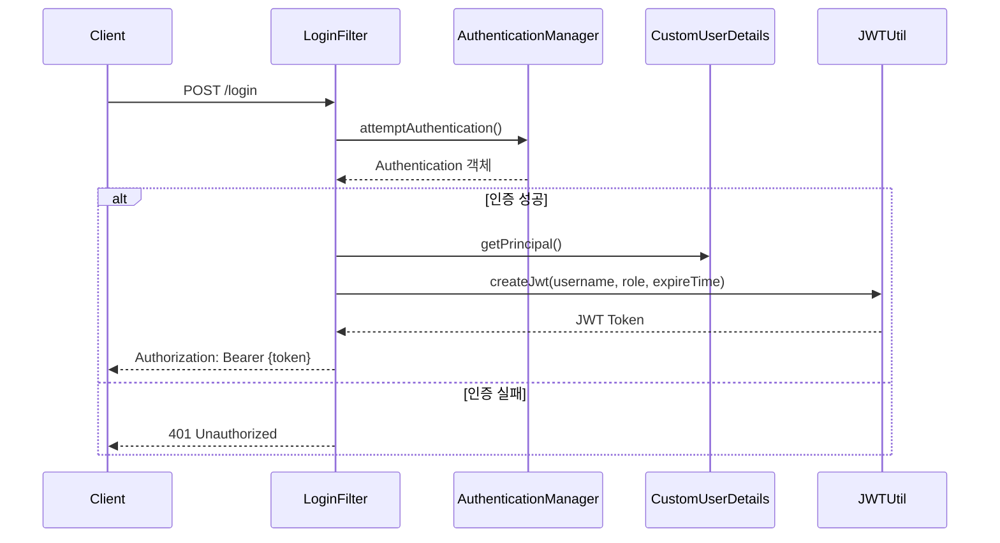

# Spring Security JWT - 로그인 성공 시 JWT 발급 구현 가이드

## 1. 인증 흐름 구조



## 2. LoginFilter 구현

### 2.1 의존성 주입
```java
public class LoginFilter extends UsernamePasswordAuthenticationFilter {
    private final AuthenticationManager authenticationManager;
    private final JWTUtil jwtUtil;

    public LoginFilter(AuthenticationManager authenticationManager, JWTUtil jwtUtil) {
        this.authenticationManager = authenticationManager;
        this.jwtUtil = jwtUtil;
    }
}
```

### 2.2 인증 성공 처리
```java
@Override
protected void successfulAuthentication(HttpServletRequest request, 
                                      HttpServletResponse response, 
                                      FilterChain chain, 
                                      Authentication authentication) {
    // 1. 사용자 정보 추출
    CustomUserDetails userDetails = (CustomUserDetails) authentication.getPrincipal();
    String username = userDetails.getUsername();
    
    // 2. 권한 정보 추출
    Collection<? extends GrantedAuthority> authorities = authentication.getAuthorities();
    Iterator<? extends GrantedAuthority> iterator = authorities.iterator();
    String role = iterator.next().getAuthority();
    
    // 3. JWT 토큰 생성
    String token = jwtUtil.createJwt(username, role, 60*60*10L); // 10시간
    
    // 4. Authorization 헤더에 JWT 토큰 추가
    response.addHeader("Authorization", "Bearer " + token);
}
```

### 2.3 인증 실패 처리
```java
@Override
protected void unsuccessfulAuthentication(HttpServletRequest request, 
                                        HttpServletResponse response, 
                                        AuthenticationException failed) {
    response.setStatus(401); // Unauthorized
}
```

## 3. SecurityConfig 설정

```java
@Configuration
@EnableWebSecurity
public class SecurityConfig {
    private final AuthenticationConfiguration authConfiguration;
    private final JWTUtil jwtUtil;

    // LoginFilter에 JWTUtil 주입
    @Bean
    public SecurityFilterChain filterChain(HttpSecurity http) throws Exception {
        http
            .addFilterAt(
                new LoginFilter(
                    authenticationManager(authConfiguration), 
                    jwtUtil
                ),
                UsernamePasswordAuthenticationFilter.class
            );
        // ... 기타 설정
        return http.build();
    }
}
```

## 4. HTTP 인증 헤더 형식
```plaintext
Authorization: Bearer {JWT_TOKEN}
```
- RFC 7235 규격에 따른 헤더 형식
- Bearer 인증 방식 사용

## 5. 주요 구현 포인트

1. **JWT 토큰 생성**
    - username과 role 정보 포함
    - 만료 시간 설정 (예: 10시간)
    - Base64 인코딩 및 서명

2. **응답 헤더 설정**
    - Authorization 헤더 사용
    - Bearer 인증 방식 명시
    - JWT 토큰 포함

3. **예외 처리**
    - 인증 실패 시 401 상태 코드
    - 적절한 에러 메시지 전달

## 6. 보안 고려사항

1. **토큰 보안**
    - 적절한 만료 시간 설정
    - HTTPS 사용 권장
    - 민감 정보 포함 금지

2. **헤더 보안**
    - CORS 설정 확인
    - XSS 방어
    - CSRF 보호 (필요시)