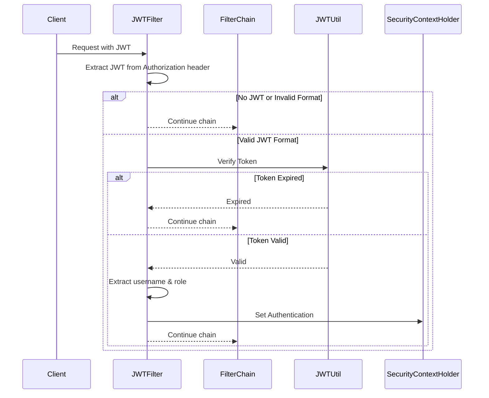

# Spring Security JWT - 토큰 검증 필터 구현 가이드

## 1. JWT 검증 프로세스



## 2. JWTFilter 구현

```java
public class JWTFilter extends OncePerRequestFilter {
    private final JWTUtil jwtUtil;

    @Override
    protected void doFilterInternal(HttpServletRequest request, 
                                  HttpServletResponse response, 
                                  FilterChain filterChain) throws ServletException, IOException {
        // 1. Authorization 헤더 추출
        String authorization = request.getHeader("Authorization");
        
        // 2. 유효한 토큰 형식인지 검증
        if (authorization == null || !authorization.startsWith("Bearer ")) {
            filterChain.doFilter(request, response);
            return;
        }
        
        // 3. 토큰 추출
        String token = authorization.split(" ")[1];
        
        // 4. 토큰 만료 여부 검증
        if (jwtUtil.isExpired(token)) {
            filterChain.doFilter(request, response);
            return;
        }
        
        // 5. 토큰에서 사용자 정보 추출
        String username = jwtUtil.getUsername(token);
        String role = jwtUtil.getRole(token);
        
        // 6. UserEntity 생성 및 설정
        UserEntity userEntity = new UserEntity();
        userEntity.setUsername(username);
        userEntity.setPassword("temppassword"); // 임시 비밀번호
        userEntity.setRole(role);
        
        // 7. Authentication 객체 생성
        CustomUserDetails customUserDetails = new CustomUserDetails(userEntity);
        Authentication authToken = new UsernamePasswordAuthenticationToken(
            customUserDetails, 
            null, 
            customUserDetails.getAuthorities()
        );
        
        // 8. SecurityContext에 인증 정보 저장
        SecurityContextHolder.getContext().setAuthentication(authToken);
        
        filterChain.doFilter(request, response);
    }
}
```

- `OncePerRequestFilter`는 Spring Security에서 제공하는 추상 클래스로, 하나의 요청에 대해 딱 한 번만 필터가 실행되는 것을 보장합니다.

- `doFilterInternal` 메서드는 OncePerRequestFilter에서 실제 필터링 로직을 구현하는 핵심 메서드입니다.

## 3. SecurityConfig 설정

```java
@Configuration
@EnableWebSecurity
public class SecurityConfig {
    private final JWTUtil jwtUtil;
    
    @Bean
    public SecurityFilterChain filterChain(HttpSecurity http) throws Exception {
        http
            // JWT 필터 등록 (LoginFilter 이전에 실행)
            .addFilterBefore(new JWTFilter(jwtUtil), LoginFilter.class)
            // 기타 보안 설정
            .csrf(csrf -> csrf.disable())
            .sessionManagement(session -> session
                .sessionCreationPolicy(SessionCreationPolicy.STATELESS));
            
        return http.build();
    }
}
```

## 4. 주요 구현 포인트

1. **토큰 추출 및 검증**
    - Authorization 헤더 확인
    - Bearer 토큰 형식 검증
    - 토큰 만료 여부 확인

2. **사용자 인증 처리**
    - 토큰에서 사용자 정보 추출
    - SecurityContext에 인증 정보 저장
    - Stateless 세션 관리

3. **필터 체인 관리**
    - 검증 실패 시 즉시 다음 필터로 전달
    - 적절한 순서로 필터 등록

## 5. 보안 고려사항

1. **토큰 검증**
    - 모든 토큰 속성 철저히 검증
    - 만료 시간 확인
    - 서명 검증

2. **세션 관리**
    - Stateless 상태 유지
    - 요청별 독립적인 인증 처리

3. **에러 처리**
    - 적절한 에러 응답 제공
    - 보안 관련 정보 노출 최소화

## 6. 테스트 시나리오

1. **유효한 토큰으로 요청**
```http
GET /admin
Authorization: Bearer {valid_token}
```

2. **만료된 토큰으로 요청**
```http
GET /admin
Authorization: Bearer {expired_token}
```

3. **잘못된 형식의 토큰으로 요청**
```http
GET /admin
Authorization: {invalid_token_format}
```