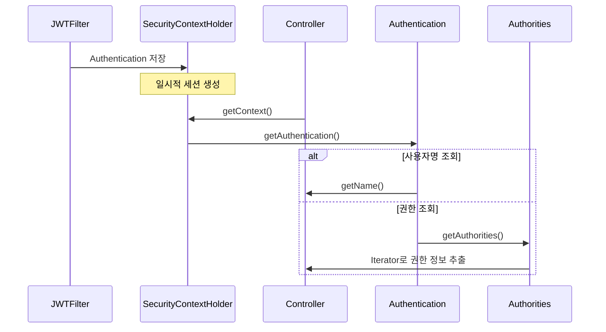

# Spring Security JWT - 세션 정보 활용 가이드

## 1. 인증된 사용자 정보 접근 방법



## 2. 컨트롤러에서 사용자 정보 접근

```java
@Controller
@ResponseBody
public class MainController {
    
    @GetMapping("/")
    public String mainP() {
        // 현재 인증된 사용자 정보 접근
        Authentication auth = SecurityContextHolder.getContext().getAuthentication();
        
        // 사용자명 조회
        String username = auth.getName();
        
        // 권한 정보 조회
        Collection<? extends GrantedAuthority> authorities = auth.getAuthorities();
        String role = authorities.iterator().next().getAuthority();
        
        return String.format("Username: %s, Role: %s", username, role);
    }
}
```

## 3. 사용자 정보 조회 메서드

### 사용자명 조회
```java
String username = SecurityContextHolder
    .getContext()
    .getAuthentication()
    .getName();
```

### 권한 정보 조회
```java
Authentication auth = SecurityContextHolder.getContext().getAuthentication();
Collection<? extends GrantedAuthority> authorities = auth.getAuthorities();
Iterator<? extends GrantedAuthority> iter = authorities.iterator();
GrantedAuthority authority = iter.next();
String role = authority.getAuthority();
```

## 4. 주요 특징

1. **일시적 세션**
    - JWT 검증 후 요청 동안만 세션 유지
    - Stateless 원칙 준수
    - 요청 종료 시 세션 소멸

2. **SecurityContextHolder**
    - 현재 스레드의 보안 컨텍스트 관리
    - ThreadLocal 기반으로 동작
    - 요청별 독립적인 컨텍스트 유지

3. **Authentication 객체**
    - 사용자 식별 정보 포함
    - 권한 정보 포함
    - Principal 정보 포함

## 5. 활용 예시

1. **사용자별 화면 커스터마이즈**
```java
@GetMapping("/dashboard")
public String dashboard() {
    String username = SecurityContextHolder.getContext()
        .getAuthentication()
        .getName();
    return "Welcome " + username;
}
```

2. **권한 기반 기능 제어**
```java
@GetMapping("/admin-panel")
public String adminPanel() {
    Authentication auth = SecurityContextHolder.getContext().getAuthentication();
    if (auth.getAuthorities().stream()
            .anyMatch(a -> a.getAuthority().equals("ROLE_ADMIN"))) {
        return "Admin Panel";
    }
    return "Access Denied";
}
```

## 6. 보안 고려사항
1. 세션 정보는 요청 범위 내에서만 유효
2. 민감한 정보는 세션에 저장하지 않음
3. 권한 검증은 서버 측에서 반드시 수행
4. 클라이언트 측 권한 검증은 UX 향상 목적으로만 사용