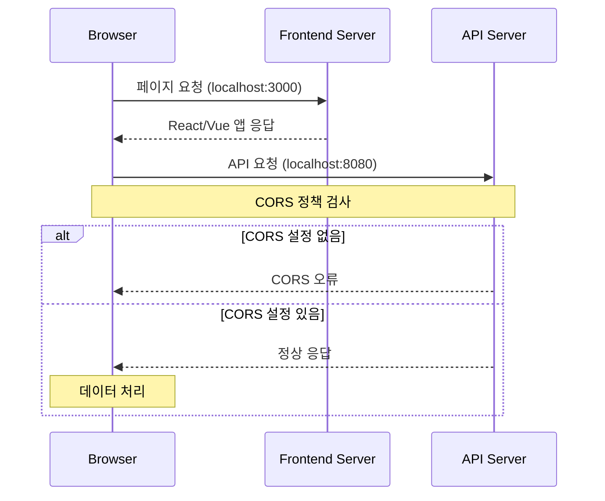

# Spring Security와 CORS 설정 가이드

## 1. CORS(Cross-Origin Resource Sharing) 개요



## 2. SecurityConfig에서 CORS 설정

```java
@Bean
public SecurityFilterChain filterChain(HttpSecurity http) throws Exception {
    http.cors(cors -> cors.configurationSource(request -> {
        CorsConfiguration config = new CorsConfiguration();
        
        // 허용할 origin 설정
        config.setAllowedOrigins(Collections.singletonList("http://localhost:3000"));
        
        // HTTP 메서드 설정
        config.setAllowedMethods(Collections.singletonList("*"));
        
        // 인증 정보 포함 설정
        config.setAllowedCredentials(true);
        
        // 허용할 헤더 설정
        config.setAllowedHeaders(Collections.singletonList("*"));
        
        // preflight 요청 캐시 시간
        config.setMaxAge(3600L);
        
        // 노출할 헤더 설정 (JWT 토큰용)
        config.setExposedHeaders(Collections.singletonList("Authorization"));
        
        return config;
    }));
    
    return http.build();
}
```

## 3. WebMvc CORS 설정

```java
@Configuration
public class CorsMvcConfig implements WebMvcConfigurer {
    
    @Override
    public void addCorsMappings(CorsRegistry registry) {
        registry.addMapping("/**")            // 모든 경로에 대해
               .allowedOrigins("http://localhost:3000");  // React 서버 허용
    }
}
```

## 4. 주요 설정 항목 설명

1. **Origin 설정**
    - 클라이언트의 출처 도메인 설정
    - 개발 환경: `http://localhost:3000`
    - 운영 환경: 실제 프론트엔드 도메인

2. **HTTP 메서드 설정**
    - `*`: 모든 HTTP 메서드 허용
    - 필요한 메서드만 명시적 설정 가능

3. **Credentials 설정**
    - `true`: 인증 정보 포함 허용
    - JWT 사용 시 필수 설정

4. **헤더 설정**
    - `AllowedHeaders`: 요청에서 사용 가능한 헤더
    - `ExposedHeaders`: 응답에서 노출할 헤더

## 5. 보안 고려사항

1. **Origin 제한**
   ```java
   // 운영 환경에서는 명확한 도메인 지정
   config.setAllowedOrigins(Collections.singletonList("https://your-domain.com"));
   ```

2. **메서드 제한**
   ```java
   // 필요한 메서드만 허용
   config.setAllowedMethods(Arrays.asList("GET", "POST", "PUT", "DELETE"));
   ```

3. **헤더 제한**
   ```java
   // 필요한 헤더만 허용
   config.setAllowedHeaders(Arrays.asList("Authorization", "Content-Type"));
   ```

## 6. 적용 시나리오

1. **개발 환경**
    - 프론트엔드: `localhost:3000`
    - 백엔드: `localhost:8080`

2. **테스트 방법**
   ```javascript
   // 프론트엔드 API 호출 예시
   fetch('http://localhost:8080/api/data', {
     credentials: 'include',
     headers: {
       'Authorization': 'Bearer ' + token
     }
   });
   ```

3. **문제 해결**
    - CORS 오류 발생 시 네트워크 탭 확인
    - Preflight 요청 확인
    - 헤더 설정 검증