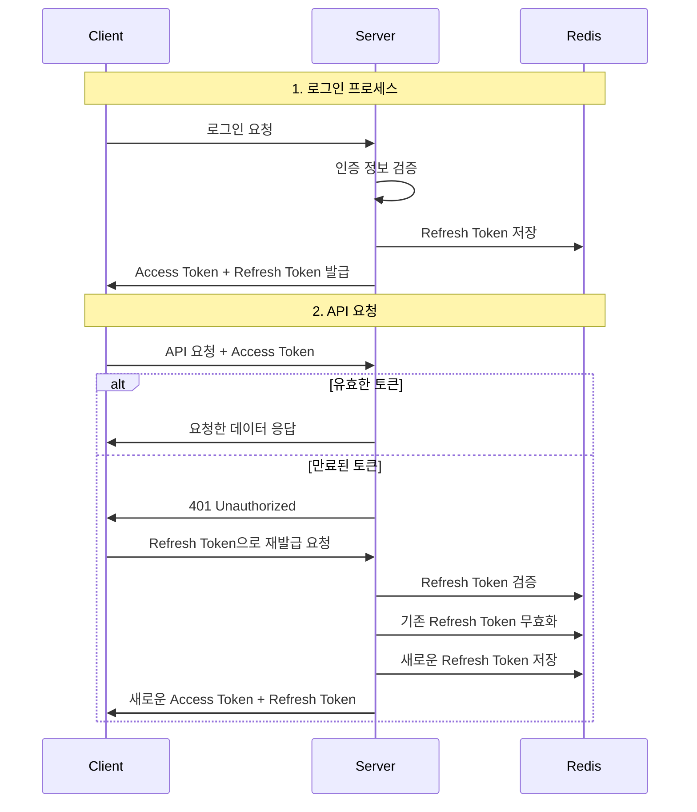

# Spring Security JWT - 토큰 보안 아키텍처



## 1. 토큰 사용과 보안 위험

### 기본 토큰 흐름
1. 로그인 성공 시 JWT 발급 (서버 → 클라이언트)
2. 권한이 필요한 모든 요청에 JWT 포함 (클라이언트 → 서버)

### 보안 위험 요소
- 빈번한 토큰 전송으로 인한 탈취 위험 증가
- XSS 공격이나 HTTP 통신 가로채기를 통한 토큰 탈취 가능성

웹 애플리케이션에서 XSS(Cross-Site Scripting) 공격은 특히 위험합니다. 악성 사용자가 웹사이트에 스크립트를 삽입하면, 다른 사용자의 브라우저에서 이 스크립트가 실행되어 localStorage에 저장된 토큰을 탈취할 수 있기 때문입니다. 이러한 취약점을 보완하기 위해 다중 토큰 전략이 등장했습니다.

## 2. Access Token과 Refresh Token 전략

### 토큰 구조
1. Access Token
    - 수명: 약 10분 (짧은 생명주기)
    - 용도: 모든 권한 필요 요청에 사용

2. Refresh Token
    - 수명: 24시간 이상
    - 용도: Access Token 만료 시 재발급용

이러한 이중 토큰 구조는 보안과 사용자 경험 사이의 균형을 제공합니다. Access Token이 탈취되더라도 10분 이내에 만료되어 공격자의 활동 시간을 제한할 수 있습니다. 반면 Refresh Token은 사용 빈도가 낮아 상대적으로 안전하며, 사용자가 자주 로그인할 필요가 없게 해줍니다.

## 3. 다중 토큰 구현 포인트

### 서버 측 구현
1. LoginSuccessHandler 구현
```java
@Component
public class LoginSuccessHandler implements AuthenticationSuccessHandler {
    @Override
    public void onAuthenticationSuccess(HttpServletRequest request, 
            HttpServletResponse response, Authentication authentication) {
        // Access Token 생성
        String accessToken = jwtProvider.generateAccessToken(authentication);
        // Refresh Token 생성
        String refreshToken = jwtProvider.generateRefreshToken(authentication);
        
        // 응답 헤더에 토큰 추가
        response.addHeader("Authorization", "Bearer " + accessToken);
        // Refresh Token은 HttpOnly 쿠키로 설정
        addRefreshTokenCookie(response, refreshToken);
    }
}
```

2. JWTFilter 구현
```java
@Component
public class JWTFilter extends OncePerRequestFilter {
    @Override
    protected void doFilterInternal(HttpServletRequest request,
            HttpServletResponse response, FilterChain filterChain) {
        try {
            // Access Token 검증
            String token = extractToken(request);
            if (jwtProvider.validateToken(token)) {
                filterChain.doFilter(request, response);
            }
        } catch (ExpiredJwtException e) {
            // 만료된 토큰 처리 - 프론트엔드에 401 응답
            response.setStatus(HttpStatus.UNAUTHORIZED.value());
            response.getWriter().write("{\"message\":\"token_expired\"}");
        }
    }
}
```

### 프론트엔드 구현
```javascript
// API 요청 인터셉터 예시
axios.interceptors.response.use(
    response => response,
    async error => {
        if (error.response.status === 401 && error.response.data.message === 'token_expired') {
            // Refresh Token으로 새로운 Access Token 요청
            const newTokens = await refreshTokens();
            // 새로운 토큰으로 원래 요청 재시도
            error.config.headers['Authorization'] = `Bearer ${newTokens.accessToken}`;
            return axios(error.config);
        }
        return Promise.reject(error);
    }
);
```

### Refresh Token 엔드포인트
```java
@RestController
public class TokenController {
    @PostMapping("/api/token/refresh")
    public ResponseEntity<?> refreshToken(@CookieValue("refresh_token") String refreshToken) {
        // Refresh Token 검증
        if (!tokenService.validateRefreshToken(refreshToken)) {
            return ResponseEntity.status(HttpStatus.UNAUTHORIZED).build();
        }
        
        // 새로운 Access Token 발급
        String newAccessToken = tokenService.generateNewAccessToken(refreshToken);
        // 새로운 Refresh Token 발급 (선택적)
        String newRefreshToken = tokenService.generateNewRefreshToken();
        
        return ResponseEntity.ok()
            .header("Authorization", "Bearer " + newAccessToken)
            .build();
    }
}
```

## 4. 토큰 저장소 전략

### Access Token 저장
- 위치: 로컬 스토리지
- 이유: 잦은 사용으로 인한 접근 용이성 필요
- 위험: XSS 공격에 취약하나 짧은 생명주기로 위험 감소

### Refresh Token 저장
- 위치: HttpOnly 쿠키
- 이유: JavaScript 접근 차단으로 XSS 방어
- 위험: CSRF 공격 가능성 있으나 제한된 엔드포인트로 위험 감소

HttpOnly 쿠키는 JavaScript를 통한 접근이 불가능하여 XSS 공격을 효과적으로 방어합니다. CSRF(Cross-Site Request Forgery) 공격은 가능하지만, Refresh 토큰은 특정 엔드포인트에서만 사용되므로 실제 위험은 제한적입니다.

## 5. Refresh Token Rotation과 블랙리스트

### Rotation 전략
1. Access Token 재발급 요청 시 새로운 Refresh Token도 함께 발급
2. 기존 Refresh Token 무효화
3. 한 번 사용된 Refresh Token 재사용 방지

### 블랙리스트 관리
- 서버 측 저장소에 Refresh Token 관리
- 로그아웃 시 토큰 즉시 무효화
- 의심스러운 토큰 사용 시 전체 토큰 무효화

실제 구현에서는 Redis와 같은 인메모리 데이터베이스를 사용하면 효율적인 토큰 관리가 가능합니다. Redis의 TTL(Time To Live) 기능을 활용하면 토큰의 자동 만료 처리도 손쉽게 구현할 수 있습니다.

## 6. 보안 강화를 위한 추가 전략

### 로그인 알림 시스템
- 새로운 IP나 브라우저에서 로그인 시 이메일 알림
- 비정상 로그인 감지 시 모든 Refresh Token 무효화
- 사용자 승인 없는 로그인 차단

보안을 한층 강화하기 위해 Device Fingerprinting을 구현할 수 있습니다. 브라우저 정보, OS, 화면 해상도 등의 정보를 조합하여 고유한 디바이스 식별자를 생성하고, 이를 토큰 발급 시 함께 검증하면 비정상적인 접근을 효과적으로 차단할 수 있습니다.