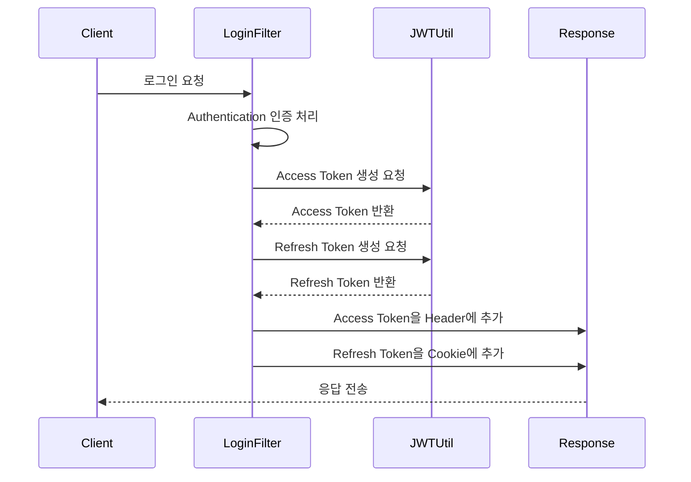

# Spring Security JWT - 다중 토큰 발급 구현 가이드

## 1. 다중 토큰 구조의 이해

이전의 단일 토큰 방식에서 Access Token과 Refresh Token을 사용하는 다중 토큰 방식으로 발전시키는 과정을 살펴보겠습니다.



## 2. 로그인 성공 핸들러 구현

### AuthenticationSuccessHandler 구현
```java
@Override
protected void successfulAuthentication(HttpServletRequest request, 
        HttpServletResponse response, FilterChain chain, 
        Authentication authentication) {
    
    // 1. 사용자 정보 추출
    String username = authentication.getName();
    Collection<? extends GrantedAuthority> authorities = authentication.getAuthorities();
    Iterator<? extends GrantedAuthority> iterator = authorities.iterator();
    GrantedAuthority auth = iterator.next();
    String role = auth.getAuthority();

    // 2. 토큰 생성
    String access = jwtUtil.createJwt("access", username, role, 600000L);  // 10분
    String refresh = jwtUtil.createJwt("refresh", username, role, 86400000L);  // 24시간

    // 3. 응답 설정
    response.setHeader("access", access);
    response.addCookie(createCookie("refresh", refresh));
    response.setStatus(HttpStatus.OK.value());
}
```

여기서 두 토큰의 생명주기가 다르게 설정된 것을 주목해야 합니다. Access Token은 10분(600000ms)으로 짧게, Refresh Token은 24시간(86400000ms)으로 길게 설정됩니다.

## 3. JWT 유틸리티 클래스 확장

### 토큰 생성 및 카테고리 구분 기능
```java
public class JWTUtil {
    
    public String createJwt(String category, String username, String role, Long expiredMs) {
        return Jwts.builder()
                .claim("category", category)    // 토큰 종류 구분
                .claim("username", username)
                .claim("role", role)
                .issuedAt(new Date(System.currentTimeMillis()))
                .expiration(new Date(System.currentTimeMillis() + expiredMs))
                .signWith(secretKey)
                .compact();
    }

    public String getCategory(String token) {
        return Jwts.parser()
                .verifyWith(secretKey)
                .build()
                .parseSignedClaims(token)
                .getPayload()
                .get("category", String.class);
    }
}
```

카테고리 필드를 추가함으로써 토큰의 용도를 명확히 구분할 수 있게 되었습니다. 이는 Refresh Token으로 Access Token용 엔드포인트에 접근하는 것을 방지하는 데 활용됩니다.

## 4. 안전한 쿠키 설정

### HttpOnly 쿠키 생성
```java
private Cookie createCookie(String key, String value) {
    Cookie cookie = new Cookie(key, value);
    cookie.setMaxAge(24*60*60);    // 24시간
    cookie.setHttpOnly(true);       // JavaScript 접근 방지
    //cookie.setSecure(true);       // HTTPS 전용 (필요시 활성화)
    //cookie.setPath("/");          // 쿠키 적용 경로
    
    return cookie;
}
```

쿠키 설정에서 특히 중요한 것은 HttpOnly 플래그입니다. 이는 JavaScript를 통한 쿠키 접근을 차단하여 XSS 공격으로부터 Refresh Token을 보호합니다. 프로덕션 환경에서는 Secure 플래그도 활성화하여 HTTPS 통신만 허용하는 것이 좋습니다.

## 5. 테스트 및 검증

성공적인 로그인 후:
1. Response Headers에서 'access' 토큰 확인
2. Response Cookies에서 'refresh' 토큰 확인
3. HTTP 상태 코드 200 확인

이러한 다중 토큰 방식은 보안과 사용자 경험 사이의 균형을 제공합니다. Access Token이 탈취되더라도 10분 후면 만료되어 피해를 최소화할 수 있으며, Refresh Token의 안전한 보관으로 장기적인 인증 상태를 유지할 수 있습니다.