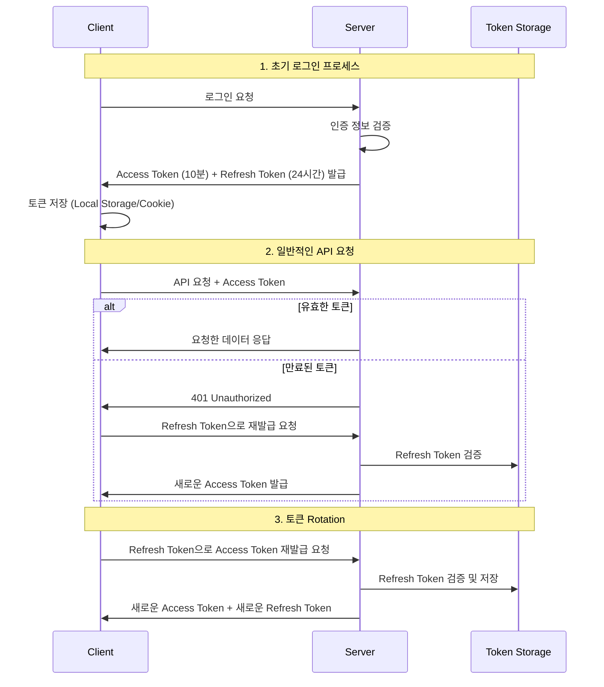

# Spring Security JWT - Access Token 필터 구현 가이드

## 1. JWT 필터의 역할과 처리 흐름

프론트엔드에서 백엔드로의 요청 처리 과정을 다음과 같이 구현합니다:



## 2. JWT 필터 구현

```java
@Component
public class JWTFilter extends OncePerRequestFilter {

    private final JWTUtil jwtUtil;

    @Override
    protected void doFilterInternal(HttpServletRequest request, 
            HttpServletResponse response, FilterChain filterChain) 
            throws ServletException, IOException {
        
        // 1. 헤더에서 Access Token 추출
        String accessToken = request.getHeader("access");

        // 2. 토큰이 없는 경우 처리
        if (accessToken == null) {
            filterChain.doFilter(request, response);
            return;
        }

        // 3. 토큰 만료 검증
        try {
            jwtUtil.isExpired(accessToken);
        } catch (ExpiredJwtException e) {
            sendErrorResponse(response, "access token expired", 
                HttpServletResponse.SC_UNAUTHORIZED);
            return;
        }

        // 4. 토큰 카테고리 검증
        String category = jwtUtil.getCategory(accessToken);
        if (!category.equals("access")) {
            sendErrorResponse(response, "invalid access token", 
                HttpServletResponse.SC_UNAUTHORIZED);
            return;
        }

        // 5. 인증 정보 설정
        setAuthentication(accessToken);
        
        filterChain.doFilter(request, response);
    }

    private void sendErrorResponse(HttpServletResponse response, 
            String message, int status) throws IOException {
        PrintWriter writer = response.getWriter();
        writer.print(message);
        response.setStatus(status);
    }

    private void setAuthentication(String accessToken) {
        String username = jwtUtil.getUsername(accessToken);
        String role = jwtUtil.getRole(accessToken);

        UserEntity userEntity = new UserEntity();
        userEntity.setUsername(username);
        userEntity.setRole(role);

        CustomUserDetails customUserDetails = new CustomUserDetails(userEntity);

        Authentication authToken = new UsernamePasswordAuthenticationToken(
            customUserDetails, null, customUserDetails.getAuthorities());
        SecurityContextHolder.getContext().setAuthentication(authToken);
    }
}
```

## 3. 주요 구현 포인트

### 토큰 검증 프로세스
1. **Access Token 존재 여부 확인**
    - 헤더에서 "access" 키로 토큰 추출
    - 토큰이 없으면 다음 필터로 진행

2. **토큰 만료 검증**
    - ExpiredJwtException 발생 시 401 응답
    - 프론트엔드에서 Refresh Token으로 재발급 요청 가능하도록 명확한 메시지 전달

3. **토큰 카테고리 검증**
    - Access Token인지 확인
    - 잘못된 토큰 타입이면 401 응답

4. **인증 정보 설정**
    - 토큰에서 username과 role 추출
    - SecurityContext에 인증 정보 설정

## 4. 프론트엔드와의 협업 포인트

### 응답 상태 코드 및 메시지
```javascript
axios.interceptors.response.use(
    response => response,
    error => {
        if (error.response.status === 401) {
            if (error.response.data === 'access token expired') {
                // Refresh Token으로 새로운 Access Token 요청
                return refreshTokenProcess();
            }
        }
        return Promise.reject(error);
    }
);
```

### 주요 응답 케이스:
- 토큰 만료: 401 "access token expired"
- 잘못된 토큰: 401 "invalid access token"

이러한 명확한 상태 코드와 메시지는 프론트엔드에서 적절한 처리를 할 수 있게 해줍니다. 예를 들어, 토큰 만료 시 자동으로 Refresh Token을 사용하여 새로운 Access Token을 요청할 수 있습니다.