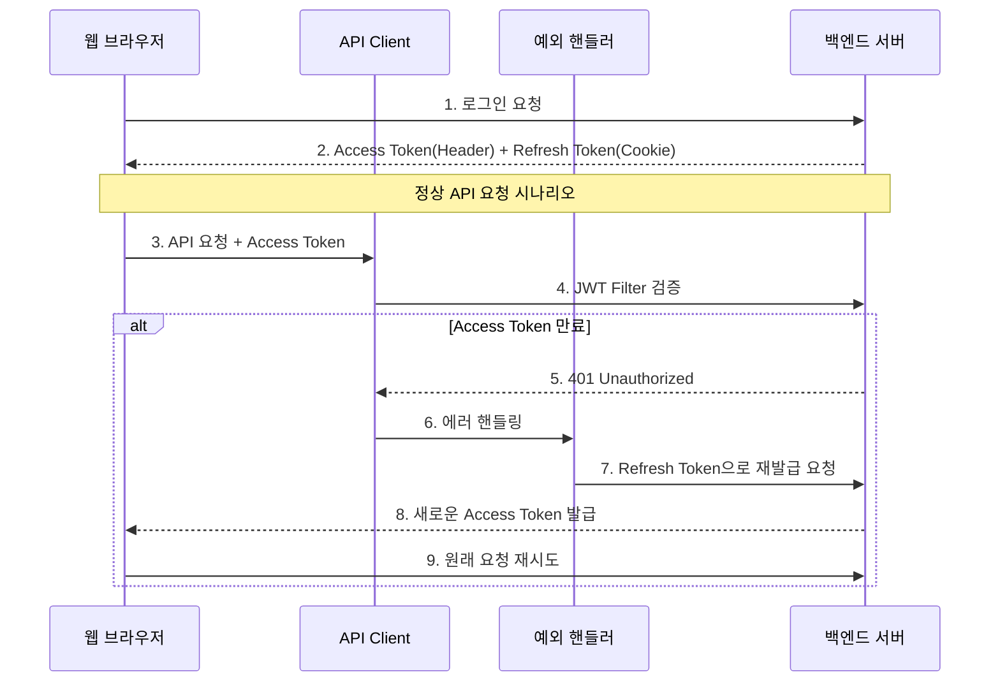

# Spring Security JWT - Access Token 재발급 구현 가이드

## 1. Access Token 재발급 프로세스

다음과 같은 순서로 Access Token 재발급이 이루어집니다:



## 2. 재발급 컨트롤러 구현

```java
@Controller
@ResponseBody
public class ReissueController {
    private final JWTUtil jwtUtil;

    public ReissueController(JWTUtil jwtUtil) {
        this.jwtUtil = jwtUtil;
    }

    // reissue 메서드: Refresh Token을 검증하고 새로운 Access Token을 발급하는 핵심 메서드
    // HttpServletRequest에서 쿠키를 추출하고 검증 후 새 토큰을 발급합니다.
    @PostMapping("/reissue")
    public ResponseEntity<?> reissue(HttpServletRequest request, HttpServletResponse response) {
        
        // 1. 쿠키에서 Refresh Token 추출
        String refresh = extractRefreshToken(request);
        if (refresh == null) {
            return new ResponseEntity<>("refresh token null", HttpStatus.BAD_REQUEST);
        }

        // 2. Refresh Token 유효성 검증
        try {
            validateRefreshToken(refresh);
        } catch (Exception e) {
            return handleTokenValidationError(e);
        }

        // 3. 새로운 Access Token 발급
        String newAccessToken = generateNewAccessToken(refresh);
        
        // 4. 응답 설정
        response.setHeader("access", newAccessToken);
        return new ResponseEntity<>(HttpStatus.OK);
    }

    // extractRefreshToken: 요청의 쿠키에서 Refresh Token을 추출하는 유틸리티 메서드
    // 쿠키 배열을 순회하며 "refresh"라는 이름의 쿠키를 찾습니다.
    private String extractRefreshToken(HttpServletRequest request) {
        Cookie[] cookies = request.getCookies();
        if (cookies != null) {
            for (Cookie cookie : cookies) {
                if (cookie.getName().equals("refresh")) {
                    return cookie.getValue();
                }
            }
        }
        return null;
    }

    private void validateRefreshToken(String refresh) {
        jwtUtil.isExpired(refresh);
        String category = jwtUtil.getCategory(refresh);
        if (!category.equals("refresh")) {
            throw new InvalidTokenException("Invalid token category");
        }
    }

    private String generateNewAccessToken(String refresh) {
        String username = jwtUtil.getUsername(refresh);
        String role = jwtUtil.getRole(refresh);
        return jwtUtil.createJwt("access", username, role, 600000L);
    }
}
```
**ReissueController**: Access Token 재발급을 담당하는 컨트롤러
JWT 유틸리티를 주입받아 토큰 검증과 생성을 수행합니다.

- 위에 작성된 코드는 **service 레이어**에 작성하는것을 추천합니다.

## 3. SecurityConfig 설정

```java
@Configuration
@EnableWebSecurity
public class SecurityConfig {
    
    @Bean
    public SecurityFilterChain filterChain(HttpSecurity http) throws Exception {
        http
            .authorizeHttpRequests(auth -> auth
                .requestMatchers("/reissue").permitAll()  // 재발급 엔드포인트는 인증 없이 접근 가능
                .anyRequest().authenticated()
            );
        // ... 기타 보안 설정
        return http.build();
    }
}
```

## 4. 프론트엔드 구현 예시

```javascript
// Axios 인터셉터 설정
axios.interceptors.response.use(
    response => response,
    async error => {
        const originalRequest = error.config;
        
        // Access Token 만료 처리
        if (error.response.status === 401 && !originalRequest._retry) {
            originalRequest._retry = true;
            
            try {
                // 재발급 요청
                const response = await axios.post('/reissue', {}, {
                    withCredentials: true  // 쿠키 전송을 위해 필요
                });
                
                // 새로운 Access Token 저장
                const newAccessToken = response.headers['access'];
                localStorage.setItem('accessToken', newAccessToken);
                
                // 원래 요청 재시도
                originalRequest.headers['Authorization'] = `Bearer ${newAccessToken}`;
                return axios(originalRequest);
            } catch (refreshError) {
                // Refresh Token도 만료된 경우 로그인 페이지로 이동
                window.location.href = '/login';
                return Promise.reject(refreshError);
            }
        }
        return Promise.reject(error);
    }
);
```

## 5. 주요 보안 고려사항

1. **토큰 검증 순서**
    - Refresh Token 존재 여부 확인
    - 만료 여부 검증
    - 토큰 카테고리 검증
    - 추가 보안 검증 (필요한 경우)

2. **에러 처리**
    - 명확한 에러 메시지 반환
    - 적절한 HTTP 상태 코드 사용
    - 보안에 민감한 정보는 제외

3. **리프레시 토큰 관리**
    - HttpOnly 쿠키 사용
    - Secure 플래그 설정 (HTTPS)
    - 적절한 만료 시간 설정

이러한 구현을 통해 안전하고 효율적인 토큰 재발급 시스템을 구축할 수 있습니다. 특히 프론트엔드와의 원활한 통합을 위해 명확한 에러 처리와 상태 코드 사용이 중요합니다.