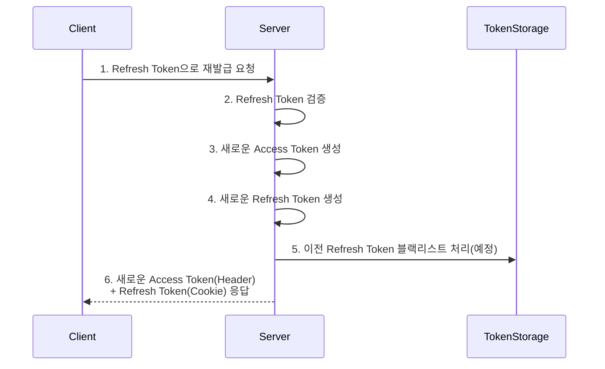

# Spring Security JWT - Refresh Token Rotation 구현 가이드

## 1. Refresh Token Rotation 개념

Refresh Token Rotation은 Access Token 재발급 시 Refresh Token도 함께 갱신하는 보안 강화 전략입니다. 주요 장점:
- 보안성 강화: 기존 Refresh Token 재사용 방지
- 지속적인 로그인 유지: 사용할 때마다 갱신되어 세션 연장 가능

## 2. 구현 과정



## 3. 컨트롤러 구현

```java
// Refresh Token 재발급을 포함한 토큰 재발급 컨트롤러
// Access Token과 함께 새로운 Refresh Token도 발급합니다.
@PostMapping("/reissue")
public ResponseEntity<?> reissue(HttpServletRequest request, HttpServletResponse response) {
    // 1. Refresh Token 추출 및 검증
    String refresh = extractAndValidateRefreshToken(request);
    
    // 2. 토큰 유효성 검사
    if (refresh == null) {
        return new ResponseEntity<>("refresh token null", HttpStatus.BAD_REQUEST);
    }
    
    // 3. 토큰 만료 체크
    validateTokenExpiration(refresh);
    
    // 4. 토큰 카테고리 확인
    validateTokenCategory(refresh);
    
    // 5. 새로운 토큰 생성
    String username = jwtUtil.getUsername(refresh);
    String role = jwtUtil.getRole(refresh);
    
    // Access Token 생성 (10분)
    String newAccess = jwtUtil.createJwt("access", username, role, 600000L);
    // Refresh Token 생성 (24시간)
    String newRefresh = jwtUtil.createJwt("refresh", username, role, 86400000L);
    
    // 6. 응답 설정
    response.setHeader("access", newAccess);
    response.addCookie(createCookie("refresh", newRefresh));
    
    return new ResponseEntity<>(HttpStatus.OK);
}
```

```java
// HttpOnly 쿠키 생성을 위한 유틸리티 메서드
// 보안을 위해 HttpOnly 플래그 설정
private Cookie createCookie(String key, String value) {
    Cookie cookie = new Cookie(key, value);
    cookie.setMaxAge(24*60*60);      // 24시간
    cookie.setHttpOnly(true);         // XSS 공격 방지
    //cookie.setSecure(true);        // HTTPS 전용
    //cookie.setPath("/");           // 쿠키 적용 경로
    
    return cookie;
}
```

## 4. 구현 시 주의사항

1. **블랙리스트 관리 필요성**
    - 기존 Refresh Token도 여전히 유효
    - 토큰 재사용 방지를 위한 블랙리스트 처리 필요
    - Redis 등을 활용한 블랙리스트 구현 예정

2. **토큰 유효성 검사**
    - 만료 여부 확인
    - 토큰 카테고리 검증
    - 블랙리스트 여부 확인 (구현 예정)

3. **보안 설정**
    - HttpOnly 쿠키 사용
    - HTTPS 환경에서 Secure 플래그 활성화 권장
    - 적절한 쿠키 만료 시간 설정

## 5. 추가 보안 고려사항

- Refresh Token 저장소 구현 필요
- 토큰 탈취 시나리오 대비
- 로그아웃 시 토큰 무효화 처리
- 비정상적인 토큰 사용 모니터링

이러한 Refresh Token Rotation 구현을 통해 보안성을 강화하고, 사용자 경험도 개선할 수 있습니다. 다음 단계에서는 블랙리스트 처리를 위한 저장소 구현이 필요합니다.