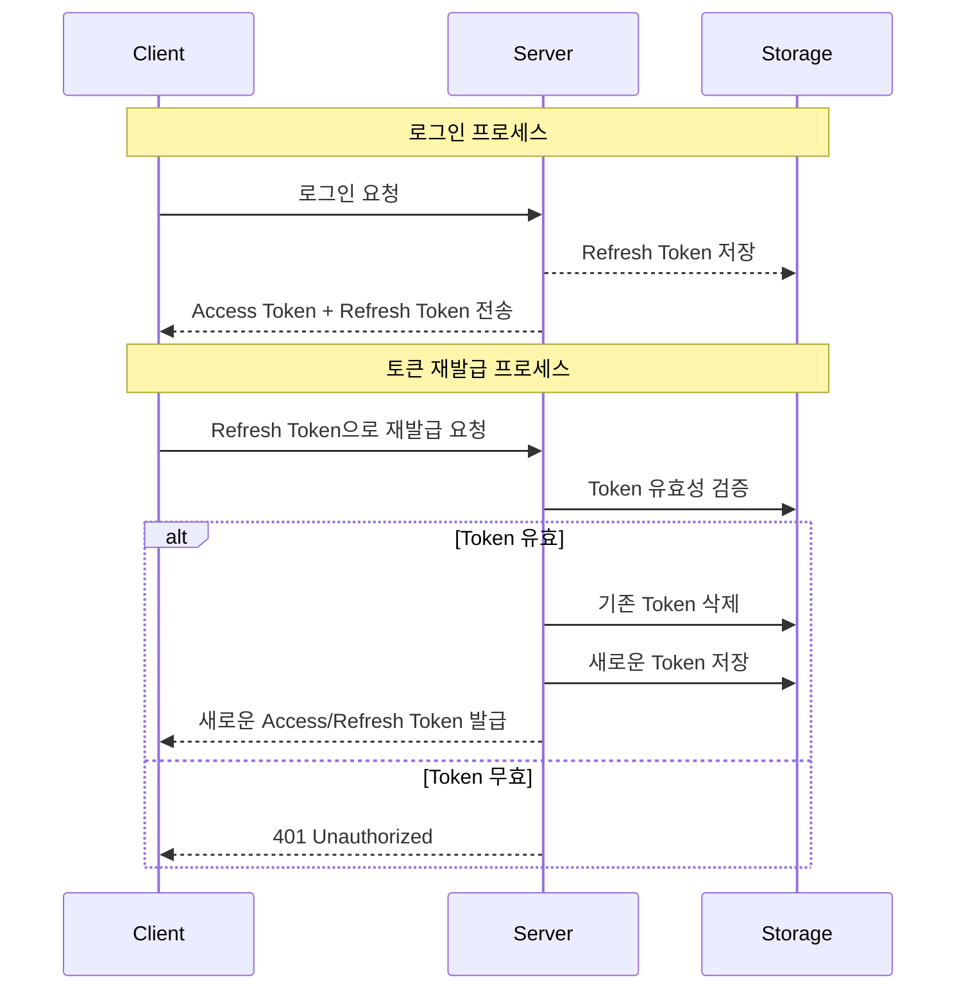

# Spring Security JWT - Refresh Token 서버 저장소 구현 가이드

## 1. 서버 측 주도권의 필요성

JWT 발급 후 클라이언트에만 토큰을 저장하면 다음과 같은 문제가 발생합니다:
- 토큰 탈취 시 서버 측에서 제어 불가능
- 로그아웃 처리의 한계
- 토큰 유효성 관리의 어려움



## 2. 토큰 저장소 구현

### RefreshEntity
```java
@Entity
@Getter
@Setter
public class RefreshEntity {
    @Id
    @GeneratedValue(strategy = GenerationType.IDENTITY)
    private Long id;

    private String username;    // 토큰 소유 사용자
    private String refresh;     // Refresh Token 값
    private String expiration;  // 만료 시간
}
```

### RefreshRepository
```java
public interface RefreshRepository extends JpaRepository<RefreshEntity, Long> {
    // 토큰 존재 여부 확인
    Boolean existsByRefresh(String refresh);

    // 토큰 삭제
    @Transactional
    void deleteByRefresh(String refresh);
}
```

## 3. 로그인 성공 시 토큰 저장

```java
@Override
protected void successfulAuthentication(HttpServletRequest request, HttpServletResponse response, 
        FilterChain chain, Authentication authentication) {
    // 사용자 정보 추출
    String username = authentication.getName();
    Collection<? extends GrantedAuthority> authorities = authentication.getAuthorities();
    Iterator<? extends GrantedAuthority> iterator = authorities.iterator();
    GrantedAuthority auth = iterator.next();
    String role = auth.getAuthority();

    // 토큰 생성
    String access = jwtUtil.createJwt("access", username, role, 600000L);
    String refresh = jwtUtil.createJwt("refresh", username, role, 86400000L);
    
    // Refresh 토큰 저장
    addRefreshEntity(username, refresh, 86400000L);

    // 응답 설정
    response.setHeader("access", access);
    response.addCookie(createCookie("refresh", refresh));
    response.setStatus(HttpStatus.OK.value());
}

// Refresh Token 저장 메서드
private void addRefreshEntity(String username, String refresh, Long expiredMs) {
    Date date = new Date(System.currentTimeMillis() + expiredMs);
    RefreshEntity refreshEntity = new RefreshEntity();
    refreshEntity.setUsername(username);
    refreshEntity.setRefresh(refresh);
    refreshEntity.setExpiration(date.toString());
    refreshRepository.save(refreshEntity);
}
```

## 4. 토큰 재발급 구현

```java
@PostMapping("/reissue")
public ResponseEntity<?> reissue(HttpServletRequest request, HttpServletResponse response) {
    // Refresh Token 추출
    String refresh = null;
    Cookie[] cookies = request.getCookies();
    for (Cookie cookie : cookies) {
        if (cookie.getName().equals("refresh")) {
            refresh = cookie.getValue();
        }
    }

    if (refresh == null) {
        return new ResponseEntity<>("refresh token null", HttpStatus.BAD_REQUEST);
    }

    // 토큰 만료 확인
    try {
        jwtUtil.isExpired(refresh);
    } catch (ExpiredJwtException e) {
        return new ResponseEntity<>("refresh token expired", HttpStatus.BAD_REQUEST);
    }

    // 토큰 타입 확인
    String category = jwtUtil.getCategory(refresh);
    if (!category.equals("refresh")) {
        return new ResponseEntity<>("invalid refresh token", HttpStatus.BAD_REQUEST);
    }
    
    // DB 저장 여부 확인
    Boolean isExist = refreshRepository.existsByRefresh(refresh);
    if (!isExist) {
        return new ResponseEntity<>("invalid refresh token", HttpStatus.BAD_REQUEST);
    }

    // 새로운 토큰 발급
    String username = jwtUtil.getUsername(refresh);
    String role = jwtUtil.getRole(refresh);
    String newAccess = jwtUtil.createJwt("access", username, role, 600000L);
    String newRefresh = jwtUtil.createJwt("refresh", username, role, 86400000L);
    
    // DB 업데이트
    refreshRepository.deleteByRefresh(refresh);
    addRefreshEntity(username, newRefresh, 86400000L);
        
    // 응답 전송
    response.setHeader("access", newAccess);
    response.addCookie(createCookie("refresh", newRefresh));

    return new ResponseEntity<>(HttpStatus.OK);
}
```

## 5. 주요 고려사항

1. **저장소 선택**
    - Redis: TTL(Time To Live) 기능으로 만료 토큰 자동 삭제
    - RDB: 별도 스케줄러로 만료 토큰 정리 필요

2. **보안 고려사항**
    - 토큰 저장 시 암호화 필요
    - 만료 토큰 정리 로직 구현
    - 동시 로그인 정책 설정

3. **성능 최적화**
    - 토큰 조회용 인덱스 설정
    - 주기적인 데이터 정리

이러한 구현을 통해 서버가 Refresh Token을 완전히 통제할 수 있으며, 토큰 탈취나 악용에 대한 대응이 가능해집니다.