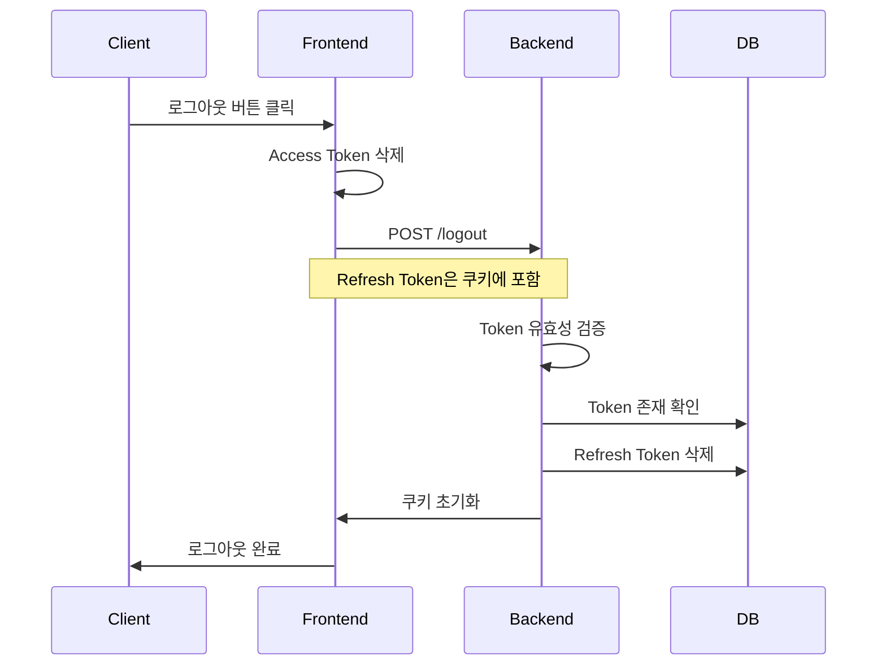

# Spring Security JWT - 로그아웃 기능 구현 가이드

## 1. 로그아웃 기능 개요

### 필요성
- 공용 컴퓨터에서의 보안
- JWT 토큰 탈취 시간 최소화
- 다중 기기 접속 관리

### 로그아웃 처리 흐름
- 프론트엔드 처리
    - 로컬 스토리지의 Access Token 삭제
    - 서버 로그아웃 엔드포인트로 요청 전송 (Refresh Token은 쿠키에 포함)

- 백엔드 처리
    - Refresh Token 검증
    - 쿠키 초기화
    - DB에서 Refresh Token 삭제



## 2. CustomLogoutFilter 구현

```java
// CustomLogoutFilter: 로그아웃 처리를 위한 필터
// GenericFilterBean을 상속받아 구현합니다.
public class CustomLogoutFilter extends GenericFilterBean {
    private final JWTUtil jwtUtil;
    private final RefreshRepository refreshRepository;

    public CustomLogoutFilter(JWTUtil jwtUtil, RefreshRepository refreshRepository) {
        this.jwtUtil = jwtUtil;
        this.refreshRepository = refreshRepository;
    }

    @Override
    public void doFilter(ServletRequest request, ServletResponse response, FilterChain chain) throws IOException, ServletException {
        doFilter((HttpServletRequest) request, (HttpServletResponse) response, chain);
    }
```

### 로그아웃 요청 검증
```java
// 로그아웃 요청 URL과 메서드 검증
private void doFilter(HttpServletRequest request, HttpServletResponse response, FilterChain filterChain) throws IOException, ServletException {
    String requestUri = request.getRequestURI();
    if (!requestUri.matches("^\\/logout$")) {
        filterChain.doFilter(request, response);
        return;
    }
    
    String requestMethod = request.getMethod();
    if (!requestMethod.equals("POST")) {
        filterChain.doFilter(request, response);
        return;
    }
```

### Refresh Token 검증
```java
// Refresh Token 추출 및 유효성 검증
String refresh = null;
Cookie[] cookies = request.getCookies();
for (Cookie cookie : cookies) {
    if (cookie.getName().equals("refresh")) {
        refresh = cookie.getValue();
    }
}

if (refresh == null) {
    response.setStatus(HttpServletResponse.SC_BAD_REQUEST);
    return;
}
```

### 로그아웃 처리
```java
// DB에서 토큰 삭제 및 쿠키 초기화
refreshRepository.deleteByRefresh(refresh);

Cookie cookie = new Cookie("refresh", null);
cookie.setMaxAge(0);
cookie.setPath("/");

response.addCookie(cookie);
response.setStatus(HttpServletResponse.SC_OK);
```

## 3. SecurityConfig 설정

```java
// SecurityConfig: 로그아웃 필터 등록
@Configuration
@EnableWebSecurity
public class SecurityConfig {
    @Bean
    public SecurityFilterChain filterChain(HttpSecurity http) throws Exception {
        http.addFilterBefore(
            new CustomLogoutFilter(jwtUtil, refreshRepository), 
            LogoutFilter.class
        );
        // ... 기타 보안 설정
        return http.build();
    }
}
```

## 4. 로그아웃 유형

### 단일 기기 로그아웃
- 현재 접속 중인 기기에서만 로그아웃
- 해당 Refresh Token만 삭제

### 전체 기기 로그아웃
- 사용자의 모든 기기에서 로그아웃
- 사용자의 모든 Refresh Token 삭제
- Repository에 추가 메서드 필요:
```java
@Transactional
void deleteAllByUsername(String username);
```

## 5. 구현 시 고려사항

### 보안
- CSRF 공격 방지
- 쿠키 보안 설정 (HttpOnly, Secure)
- 토큰 검증 절차 준수

### 사용자 경험
- 명확한 에러 메시지 제공
- 로그아웃 성공/실패 상태 전달
- 자동 로그인 설정 처리

### 성능
- 토큰 검증 로직 최적화
- DB 조회 최소화
- 불필요한 쿠키 데이터 정리

## 6. 프론트엔드 연동 예시

```javascript
// 로그아웃 처리 함수
async function handleLogout() {
    try {
        // 로컬 스토리지의 Access Token 삭제
        localStorage.removeItem('accessToken');
        
        // 서버에 로그아웃 요청
        await axios.post('/logout', {}, {
            withCredentials: true  // 쿠키 전송을 위해 필요
        });
        
        // 로그아웃 후 처리 (예: 로그인 페이지로 이동)
        window.location.href = '/login';
    } catch (error) {
        console.error('로그아웃 실패:', error);
    }
}
```

이러한 구현을 통해 안전하고 효율적인 로그아웃 처리가 가능합니다. 프론트엔드와 백엔드가 협력하여 사용자의 인증 상태를 안전하게 종료할 수 있습니다.